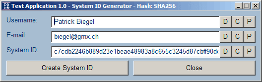
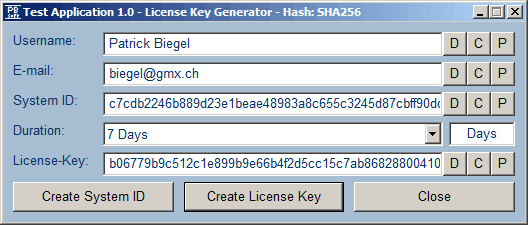
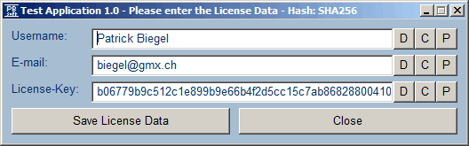
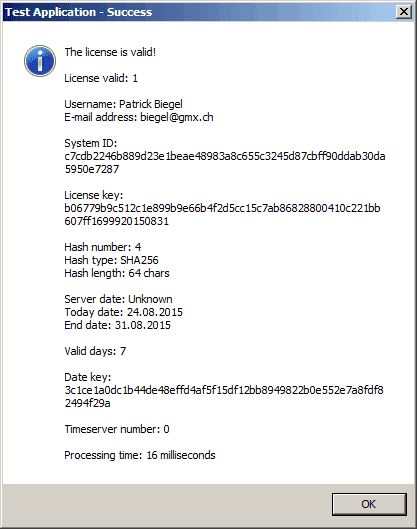
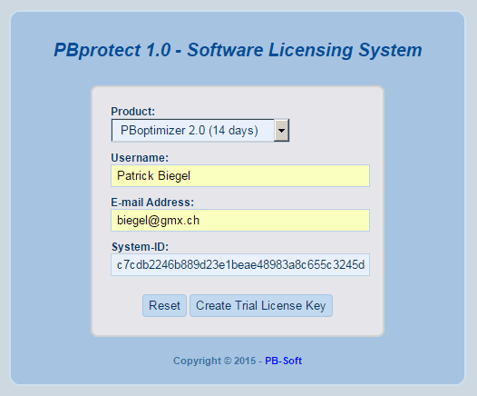
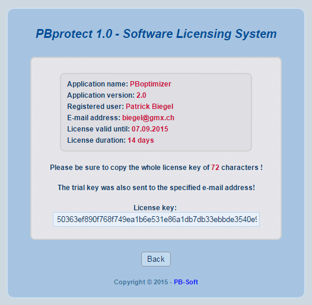
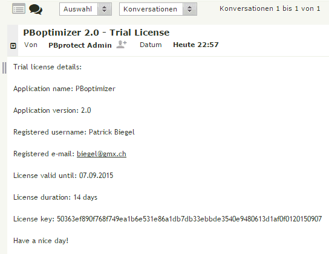

# PBprotect - README #
---

### Overview ###

The **PBprotect** tool is a licensing application for **AutoHotkey** applications. It can generate and check licenses and therefore protect the software from unlicensed use. There is also a web interface to generate trial license keys.

### Screenshots ###

### Setup ###

* Edit the **PBprotect** product configuration file **development\Source\include\PBproduct.ahk**
* Compile all **PBprotect** executables for this product with the Batch scripts **develompent\Compile_X.bat**.
* Use the executables to create a system ID, license key, and enter the license key.
* Check the default example applications **Application.exe** with the source: **Source\Application.ahk**.
* Check the mini example applications **Application.exe** with the source: **Source\Mini_appl.ahk**.
* Edit the configuration of the **PBprotect** web interface **pbprotect\web\pbprotect\config\config.php**.
* Upload the whole directory **pbprotect\web\pbprotect** to your webhost (needs PHP installed).
* Display the page **pbprotect/pbprotect.php** and enter the details to generate a trial license.

### Support ###

This is a free tool and support is not included and guaranteed. Nevertheless I will try to answer all your questions if possible. So write to my email address **biegel[at]gmx.ch** if you have a question :-)

### License ###

The **PBprotect** tool is licensed under the [**MIT License (Expat)**](http://pb-soft.com/resources/mit_license/license.html) which is published on the official site of the [**Open Source Initiative**](http://opensource.org/licenses/MIT).
